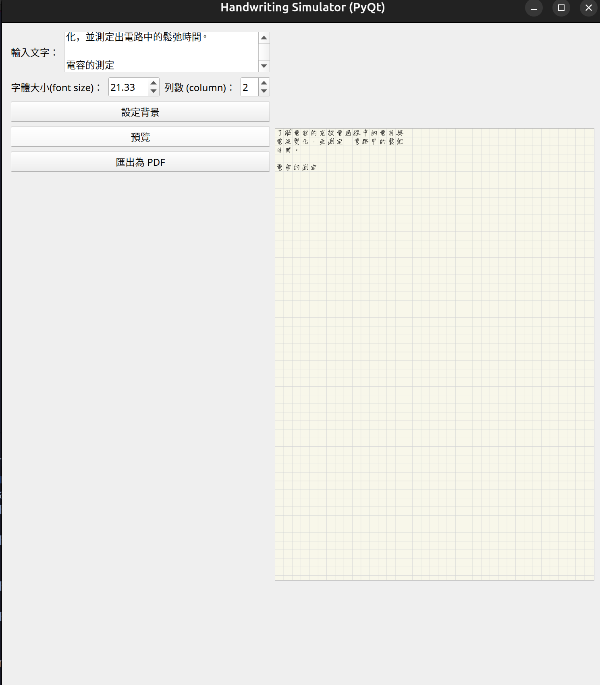

# Handwrite


## Features  
- 能夠將文章隨機轉換為預先設定的手寫字，但同時允許用戶自己調整
- 將手寫字匯出成pdf 
- 嘗試模擬筆記軟體的風格（如背景）

## Install
### 使用pip
```bash
# 下載專案
git clone git@github.com:yushiuan9499/handwrite.git
# 進入專案資料夾
cd handwrite
# 安裝依賴
pip install -r requirements.txt
```
### 使用uv
```bash
# 下載專案
git clone git@github.com:yushiuan9499/handwrite.git
# 進入專案資料夾
cd handwrite
# 安裝依賴
uv sync
```
## Usage
### 設定字形
- 將字的.svg檔案放在`data/font/<word>`資料夾中  
  例如`範`這個字就放在`data/font/範/`資料夾中

### 執行
```bash
python main.py
```

